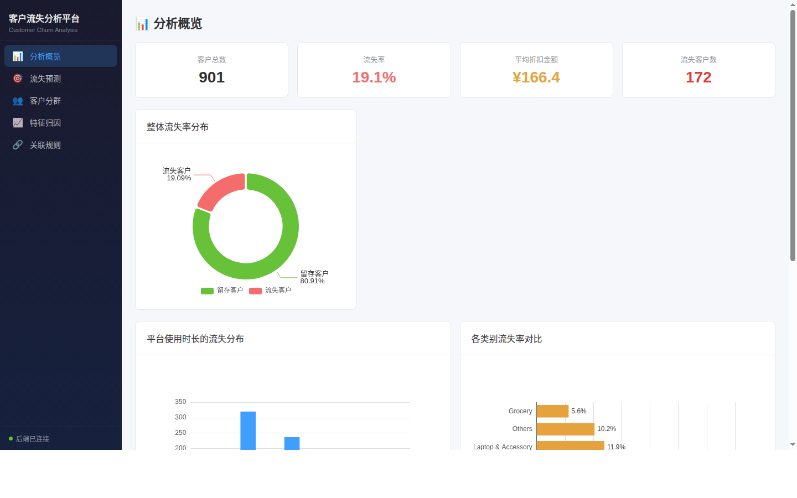
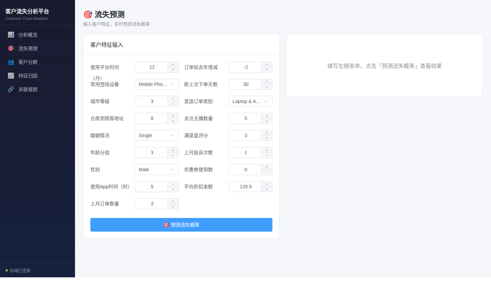
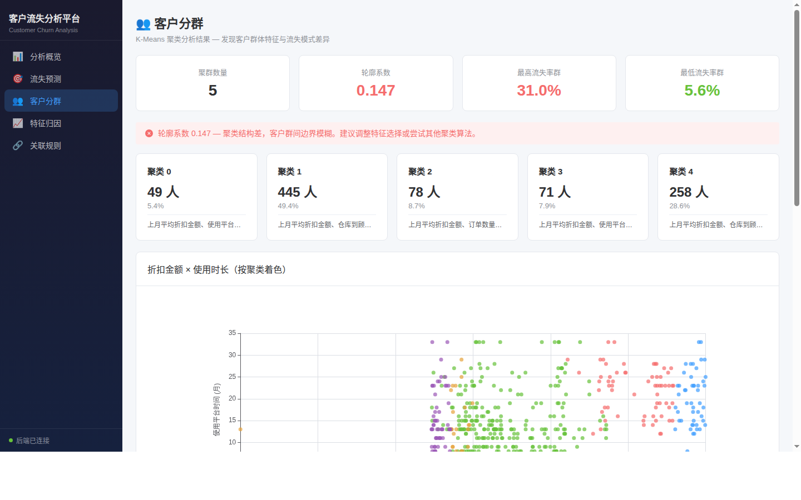
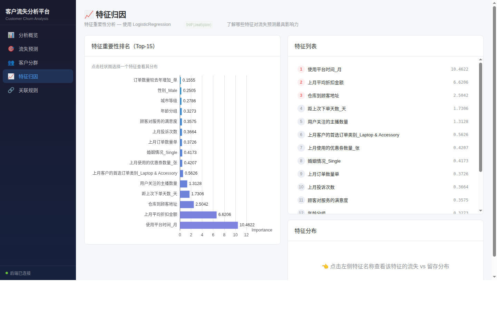
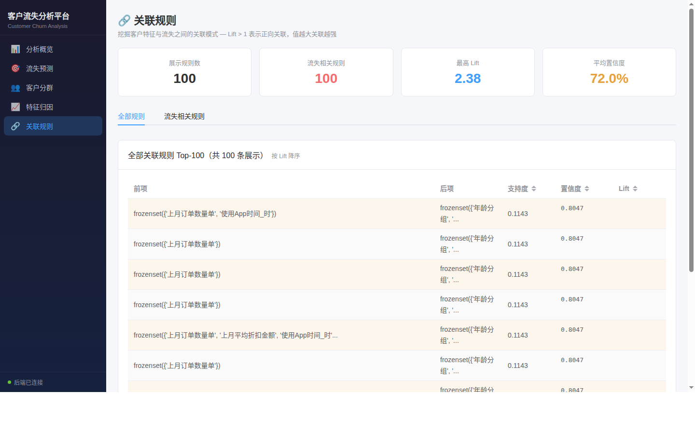

# 客户流失分析平台

[](https://python.org)
[](https://vuejs.org)
[](https://fastapi.tiangolo.com)
[](LICENSE)

> 端到端客户流失分析平台，涵盖关联规则挖掘、K-Means 聚类、多模型预测（LR/RF/XGBoost）、SHAP 可解释性，搭配 Vue3 交互式数据大屏 —— 数据分析/商业分析方向校招作品集项目。

---

## 项目概述

理解客户*为什么*流失，是留住客户的第一步。本项目基于真实业务场景的客户行为数据（901 条 × 19 列），完成了从数据清洗、特征工程、无监督聚类、有监督预测到模型可解释性的完整分析链路。分析结果通过 FastAPI 后端提供服务，由 Vue3 + ECharts 交互式大屏展示。

**核心结论**：SHAP 分析确认上月平均折扣金额、使用平台时间和仓库距离是预测客户流失的最强信号。最佳模型（Logistic Regression）在留出测试集上达到 **ROC-AUC 0.8487**，召回率 62.9%。

---

## 主要功能

### 数据处理

- 多格式数据加载（Excel、CSV），自动类型优化
- 内存高效处理 —— 通过 dtype 优化降低约 40% 内存占用
- 自动化数据质量报告（缺失值统计、分布概况、异常值检测）

### 特征工程

- 三种编码策略：One-Hot、Mixed、Standardized
- 基于 MeanShift 的自适应分箱
- 基于随机森林和互信息的特征重要性评估

### 机器学习

- **3 模型对比**：Logistic Regression（ROC-AUC **0.8605**）、Random Forest（0.8301）、XGBoost（0.8540）
- 分层 K 折交叉验证（k=5）+ GridSearchCV 超参调优
- 自动选择最佳模型并持久化（`.pkl`）

### 模型可解释性

- SHAP TreeExplainer 和 LinearExplainer 特征贡献分析
- 特征重要性排名（标注来源：Gini 重要性 / |coefficient| 系数绝对值）
- 个体预测的特征归因上下文

### 客户分群

- K-Means 聚类（k=5）客户群体发现
- K-Prototypes 混合数据类型聚类
- 重复聚类 + Rand Index 稳定性测试

### 关联规则挖掘

- Apriori 和 FP-Growth 算法，自动参数优化
- 发现 4,398 条规则，其中 395 条与流失直接相关
- 最强流失规则：*折扣 + 流失 → 投诉 + App使用*（Lift = 1.86）

### 交互式大屏

- **5 页面 Vue3 SPA**：分析概览、流失预测、客户分群、特征归因、关联规则
- **ECharts 可视化**：仪表盘、柱状图、散点图、饼图，支持交互式下钻
- **实时预测**：17 字段客户表单 → 实时流失概率 + 风险等级
- **API 健康监控**：侧边栏实时后端状态检测

---

## 技术栈

| 层级               | 技术                                 | 用途                         |
| ------------------ | ------------------------------------ | ---------------------------- |
| **后端**     | Python 3.9+, FastAPI                 | API 服务，9 个端点           |
| **机器学习** | scikit-learn, XGBoost, SHAP, mlxtend | 建模、可解释性、规则挖掘     |
| **数据处理** | pandas, numpy                        | 数据清洗、特征工程           |
| **可视化**   | Plotly, Matplotlib                   | Python 侧图表生成            |
| **前端**     | Vue 3.4, TypeScript, Vite 8          | SPA 框架                     |
| **UI 组件**  | Element Plus 2.x                     | 组件库                       |
| **图表**     | ECharts 5.5                          | 仪表盘、柱状图、散点图、饼图 |
| **HTTP**     | Axios 1.6                            | API 通信                     |
| **路由**     | Vue Router 4                         | 客户端导航                   |

---

## 系统架构

```text
┌─────────────────────────────────────────────────────────┐
│                    浏览器 (:5173)                        │
│  ┌──────────────────────────────────────────────────┐   │
│  │            Vue3 SPA (Vite 开发服务器)              │   │
│  │  ┌────────┐ ┌──────────┐ ┌────────────┐          │   │
│  │  │分析概览│ │流失预测  │ │客户分群    │ ...      │   │
│  │  └────────┘ └──────────┘ └────────────┘          │   │
│  └──────────────────┬───────────────────────────────┘   │
│                     │ /api/* (代理)                      │
└─────────────────────┼───────────────────────────────────┘
                      │
┌─────────────────────┼───────────────────────────────────┐
│              FastAPI (:8000)                             │
│  ┌──────────────────┴───────────────────────────────┐   │
│  │  api.py (预测, 健康检查) + api_v2.py (分析数据)   │   │
│  └──────────┬───────────────────────┬────────────────┘   │
│             │                       │                    │
│  ┌──────────▼──────────┐ ┌─────────▼────────────────┐   │
│  │ output/models/*.pkl │ │ output/results/*.json     │   │
│  │ (训练好的模型)       │ │ (预计算分析结果)         │   │
│  └─────────────────────┘ └──────────────────────────┘   │
└─────────────────────────────────────────────────────────┘
```

95% 的 API 端点直接返回预计算 JSON，零实时计算开销。仅 `POST /api/predict` 加载模型进行实时推理。

---

## 项目结构

```text
customer_churn_analysis/
├── data/
│   └── customer_churn_data.xlsx       # 901 行 × 19 列
├── src/
│   ├── data_loader.py                 # 数据加载 + 质量报告
│   ├── feature_engineering.py         # 特征预处理
│   ├── association_rules.py           # Apriori / FP-Growth 挖掘
│   ├── clustering.py                  # K-Means / K-Prototypes
│   ├── prediction.py                  # LR / RF / XGBoost 建模
│   ├── explainability.py              # SHAP 解释
│   ├── visualization.py               # Plotly / Matplotlib
│   ├── api.py                         # FastAPI 预测服务
│   └── api_v2.py                      # 分析展示 API
├── frontend/                          # Vue3 SPA
│   └── src/
│       ├── views/                     # 5 个页面组件
│       ├── components/                # 10 个可复用组件
│       ├── api/                       # Axios API 层
│       └── utils/                     # 格式化工具 + 常量
├── output/
│   ├── models/churn_model.pkl         # 最佳模型文件
│   ├── results/                       # JSON 分析结果
│   └── visualizations/                # 生成的图表
├── tests/                             # 29 个测试用例
├── notebooks/                         # Jupyter 分析演示
│   └── customer_churn_analysis.ipynb
├── PROJECT_STATUS.md                  # 项目状态报告（中文）
├── PROJECT_REPORT.md                  # 完整分析报告（中文）
├── TUTORIAL.md                        # 零基础自学教程（中文）
├── README.md                          # 本文件（中文）
└── README_EN.md                       # 英文版
```

---

## 页面截图

> 以下为实际运行截图。

| 页面                                      | 说明                                              |
| ----------------------------------------- | ------------------------------------------------- |
|      | KPI 卡片、流失饼图、使用时长/品类图表、模型对比表 |
|    | 17 字段表单 + ECharts 仪表盘 + 风险等级标签       |
|  | 聚类卡片、散点图、轮廓系数质量警告                |
|      | Top-15 重要性图、点击联动分布图、百分比切换       |
|         | 可排序规则表格、Lift 高亮、流失规则筛选           |

---

## 模型性能

在 720 条训练样本上训练，181 条留出样本上评估（20% 分层分割）。

| 模型                             | Accuracy         | Precision        | Recall | F1 Score         | ROC-AUC          |
| -------------------------------- | ---------------- | ---------------- | ------ | ---------------- | ---------------- |
| **Logistic Regression** 🔥 | 0.8232           | 0.5366           | 0.6286 | 0.5789           | **0.8487** |
| Random Forest                    | 0.8343           | **0.7778** | 0.2000 | 0.3182           | 0.8252           |
| XGBoost                          | **0.8619** | 0.7273           | 0.4571 | **0.5614** | 0.8423           |

**ROC-AUC 最佳**: LogisticRegression（0.8487）。**Recall 最佳**: LogisticRegression（62.9% —— 适合"宁可多预警，不漏过一个"）。**Precision 最佳**: RandomForest（77.8%，仅 2 个误报 —— 适合挽留预算有限的场景）。**综合最佳**: XGBoost（Accuracy 86.19% 最高，Precision 72.7%）。

> ✅ xgboost 3.2.0 + shap 0.48.0 已安装，全部 3 个模型可用。SHAP 特征重要性已接入 API。

| 模型                | 混淆矩阵（TN, FP, FN, TP）  |
| ------------------- | --------------------------- |
| Logistic Regression | TN=127, FP=19, FN=13, TP=22 |
| Random Forest       | TN=144, FP=2, FN=28, TP=7   |
| XGBoost             | TN=140, FP=6, FN=19, TP=16  |

---

## API 端点

| 方法     | 端点                                 | 说明                        |
| -------- | ------------------------------------ | --------------------------- |
| `GET`  | `/`                                | 服务信息                    |
| `GET`  | `/health`                          | 健康检查 + 模型状态         |
| `POST` | `/predict`                         | 单客户流失预测              |
| `GET`  | `/api/summary`                     | 数据集概览统计              |
| `GET`  | `/api/model/metrics`               | 模型对比指标                |
| `GET`  | `/api/model/importance`            | 特征重要性 Top-15           |
| `GET`  | `/api/clusters`                    | K-Means 聚类概览 + 散点数据 |
| `GET`  | `/api/rules`                       | 关联规则 Top-100            |
| `GET`  | `/api/data/distribution/{feature}` | 单特征分布直方图            |

---

## 环境安装

```bash
# 克隆仓库
git clone https://github.com/WaGll/customer-churn-analysis.git
cd customer_churn_analysis

# 安装 Python 依赖
pip install -r requirements.txt

# 安装前端依赖
cd frontend && npm install
```

**系统要求**：Python 3.9+，Node.js 18+，建议 8GB+ 内存。

---

## 快速开始

```bash
# 1. 运行完整分析流程（生成所有输出文件）
python run_analysis.py

# 2. 启动 API 服务
python run_api.py
# → http://127.0.0.1:8000

# 3. 启动前端开发服务器（新终端）
cd frontend && npm run dev
# → http://localhost:5173
```

浏览器打开 `http://localhost:5173`。Vite 开发服务器自动将 `/api` 请求代理到 FastAPI 后端。

### API 快速测试

```bash
# 健康检查
curl http://127.0.0.1:8000/health

# 获取数据摘要
curl http://127.0.0.1:8000/api/summary | python -m json.tool

# 预测客户流失概率
curl -X POST http://127.0.0.1:8000/api/predict \
  -H "Content-Type: application/json" \
  -d '{
    "使用平台时间_月": 12,
    "常用登陆设备": "Mobile Phone",
    "城市等级": 3,
    "仓库到顾客地址": 15,
    "婚姻情况": "Single",
    "年龄分组": 3,
    "性别": "Male",
    "使用App时间_时": 5,
    "上月订单数量单": 3,
    "订单数量较去年增加_单": 2,
    "距上次下单天数_天": 10,
    "上月客户的首选订单类别": "Laptop & Accessory",
    "用户关注的主播数量": 2,
    "顾客对服务的满意度": 3,
    "上月投诉次数": 0,
    "上月使用的优惠劵数量_张": 1,
    "上月平均折扣金额": 120
  }'
```

---

## 开发工作流

```bash
# 后端：代码变更自动重载
uvicorn src.api:app --reload --host 0.0.0.0 --port 8000

# 前端：热模块替换（HMR）
cd frontend && npm run dev

# 运行全部测试
pytest tests/ -v

# 前端生产构建
cd frontend && npm run build
# → dist/（可用于静态托管）
```

---

## 未来改进

- [X] 安装 `xgboost` + `shap` 以启用全部模型和 SHAP 可视化 ✅
- [ ] 优化聚类质量（尝试 k=3、PCA 预处理、DBSCAN）
- [ ] 添加关联规则网络图（ECharts graph 系列）
- [ ] 支持 CSV 批量预测上传
- [X] 添加 404 路由处理 ✅
- [ ] 添加加载骨架屏
- [ ] 添加前端单元测试（Vitest）
- [ ] 前端部署到 GitHub Pages / Vercel

---

## 简历项目描述

> **客户流失分析平台** — 设计并构建了端到端客户流失预测系统，处理 901 条客户行为与人口统计特征数据。应用 FP-Growth 关联规则挖掘（4,398 条规则，395 条流失相关）和 K-Means 聚类识别客户细分群体与流失模式。使用分层交叉验证和 GridSearchCV 对比 3 种机器学习模型（Logistic Regression、Random Forest、XGBoost），最佳模型达到 **ROC-AUC 0.8487**（召回率 62.9%）。应用 SHAP LinearExplainer 实现模型可解释性，揭示驱动个体预测的关键特征。构建 FastAPI 预测服务（9 个端点），预计算分析结果零延迟响应。开发 Vue3 + ECharts 交互式大屏，支持实时流失预测和下钻分析。编写 29 个自动化测试用例确保流程可靠性。

---

## 相关文档

| 文档                                  | 说明                                                   |
| ------------------------------------- | ------------------------------------------------------ |
| [PROJECT_STATUS.md](./PROJECT_STATUS.md) | 项目状态报告 — 架构、已完成功能、已知限制、下一步计划 |
| [PROJECT_REPORT.md](./PROJECT_REPORT.md) | 完整分析报告 — 15 章节，从业务背景到改进建议          |
| [TUTORIAL.md](./TUTORIAL.md)             | 零基础自学教程 — 从环境配置到运行大屏的完整指南       |
| [README_EN.md](./README_EN.md)           | English version of this document                       |

---

## 许可证

MIT License — 详见 [LICENSE](LICENSE)。

---

⭐ **给个 Star** 如果这个项目对你的数据分析学习之路有帮助！
